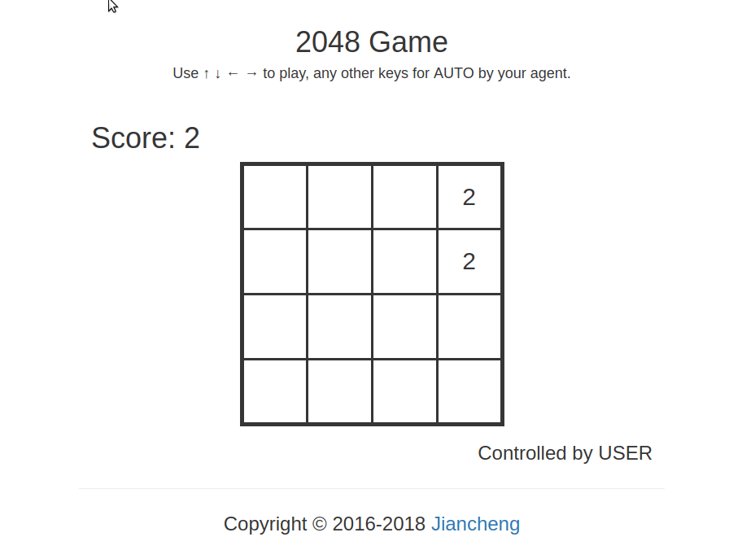

# 2048-MLmodel_lgj
A 2048 game api with training supervised learning (imitation learning) model and experiment

# Code structure
* [`exp_imitation_learning/`](exp_imitation_learning/): the package for imitation learning experiment of 2048.
    * [`datadeal.py`](exp_imitation_learning/datadeal.py): some classes for dataset deal .
    * [`dataset_generator.py`](exp_imitation_learning/dataset_generator.py): code to generate dataset.
    * [`model.py`](exp_imitation_learning/model.py): some ML models for game2048 .
    * [`train.py`](exp_imitation_learning/train.py): code to train model

* [`game2048/`](game2048/): the main package.
    * [`game.py`](game2048/game.py): the core 2048 `Game` class.
    * [`agents.py`](game2048/agents.py): the `Agent` class with instances, including myRNNagent to test model.
    * [`displays.py`](game2048/displays.py): the `Display` class with instances, to show the `Game` state.
    * [`expectimax/`](game2048/expectimax): a powerful ExpectiMax agent by [here](https://github.com/nneonneo/2048-ai).
* [`model/`](model/): RNN model trained by gjliu.
* [`explore.ipynb`](explore.ipynb): introduce how to use the `Agent`, `Display` and `Game`.
* [`agent_test.ipynb`](agent_test.ipynb): to test agent.
* [`preprocess.ipynb`](preprocess.ipynb): ipynb file for debug.
* [`preprocess000.ipynb`](preprocess000.ipynb): ipynb file for debug.
* [`static/`](static/): frontend assets (based on Vue.js) for web app.
* [`webapp.py`](webapp.py): run the web app (backend) demo.
* [`evaluate.py`](evaluate.py): evaluate your self-defined agent.

# Environment
* code only tested on linux system (ubuntu 16.04)
* Python 3 (Anaconda 3.6.3 specifically) with numpy and flask
* pytorch 1.0


# To generate dataset

```bash
cd exp_imitation_learning
python dataset_generator.py
```

# To train model

```bash
cd exp_imitation_learning
python train.py
```
# To compile the pre-defined ExpectiMax agent

```bash
cd game2048/expectimax
bash configure
make
```

# To run the web app
```bash
python webapp.py
```


# LICENSE
The code is under Apache-2.0 License.

# For EE369 / EE228 students from SJTU
Please read course project [requirements](EE369.md) and [description](https://docs.qq.com/slide/DS05hVGVFY1BuRVp5). 
